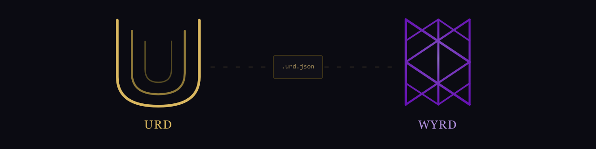

# URD & WYRD

**A declarative schema system for interactive worlds**

Define in Urd. Test in Wyrd. Ship anywhere.

In Norse mythology, Urð is the Norn of fate — the keeper of what is and what was. The schema that defines the world. Wyrd, its Old English cognate, is destiny unfolding — what happens. The runtime that executes it.

---

> ⚠️ **Nothing here is set in stone.** This project is early and in motion. Designs will be revised. Assumptions will be proven wrong. Entire approaches may be scrapped and rebuilt from scratch. Like any good roguelike, death is not a bug — it's a mechanic. Each failed run carries forward what was learned.

Urd is an open, structured world definition format — a declarative schema that describes interactive worlds as typed, validated, engine-agnostic data. Writers author in **Schema Markdown**, a prose-friendly syntax as clean as ink for pure dialogue but schema-native by design. The compiler validates and produces a single `.urd.json` contract file. The runtime executes it. No custom glue code. No integration tax.

> Here's the Monty Hall problem defined in Urd. Notice we never specified a probability. The 2/3 switching advantage emerges from the world rules alone.

## The Problem

Narrative game development suffers from a **fragmentation tax**. Every team cobbles together ink or Yarn Spinner for dialogue, articy:draft or spreadsheets for world data, custom C# or GDScript for integration, and ad-hoc playtesting for QA. 30–50% of development effort goes to glue code that is never reusable.

There is no standard interface between "narrative data" and "game state." Urd is that interface.

## How It Works

Urd is a pipeline, not a monolith:

```
.urd.md files  →  Compiler  →  .urd.json  →  Runtime / Testing / Engine Integrations
```

**Writers** author scenes in Schema Markdown — prose with seven symbols (`@` `?` `>` `*` `+` `->` `==`). Their frontmatter is one line: `import: ./world.urd.md`. Everything else is narrative.

**Engineers** define types, entities, and behavioral rules in separate schema files. Writers never touch them.

**The `.urd.json` contract** is the boundary. The compiler produces it. Everything downstream consumes it. Self-contained, deterministic, versioned, human-inspectable.

## What It Looks Like

A writer's file:

```
---
import: ./world.urd.md
---

# The Rusty Anchor
A low-ceilinged tavern thick with pipe smoke.
[@arina]

== topics
@arina: What'll it be, stranger?

+ Ask about the harbor
  @arina: Quiet today. Too quiet.
  > @arina.trust + 5
  -> topics

* Ask about the missing ship
  ? @arina.trust > 50
  @arina: The Selene didn't sink. She was taken.

  ? @arina.trust <= 50
  @arina: I don't know what you're talking about.
  -> topics

* Leave -> harbor

@arina: Suit yourself. I've got glasses to clean.
```

`*` choices disappear after selection. `+` choices stay. `?` gates on conditions. `>` mutates state. `->` jumps. `@` references typed entities. The compiler validates everything. The runtime executes it.

## Schema Primitives

The Urd World Schema v0.1 covers:

- **Entities & Types** — typed objects with properties, defaults, and constraints
- **Containment** — one universal spatial primitive (a room holds a sword, a chest holds a sword, a player holds a sword — same mechanism)
- **Visibility** — properties are visible, hidden, owner-only, or conditionally revealed
- **Locations & Exits** — rooms with gated connections
- **Rules** — constrained NPC behavior referencing hidden state
- **Sequences** — phased progression (game rounds, tutorials, rituals)
- **Dialogue** — sections, hubs, sticky/one-shot choices, exhaustion, jumps
- **Conditions & Effects** — a minimal expression language for state checks and mutations

## Components

| Component | Role | Status |
|-----------|------|--------|
| **Compiler** | `.urd.md` → `.urd.json`. Parse, import, link, validate, emit. | v0.1 designed — awaiting implementation |
| **Wyrd** | Reference runtime. Loads compiled JSON, executes the world, produces events. Browser-native. | v0.1 designed — awaiting implementation |
| **Testing** | Schema validation, reachability analysis, playthrough simulation, coverage reporting. | v0.1 designed — awaiting implementation |
| **LSP** | Language server wrapping the compiler. Live diagnostics, autocomplete, go-to-definition. | Planned |
| **IDE** | Structured authoring environment with writer and engineer modes. | Planned |

Wyrd is the canonical runtime — any behavioral ambiguity in the spec is resolved by what Wyrd does.

## Validation Strategy

Three progressive test cases, each proving capabilities the previous one couldn't:

1. **Monty Hall Problem** — Hidden state, NPC constraints, emergent probability. Run 10,000 games; the 2/3 switching advantage falls out of the structure.
2. **Two-Room Key Puzzle** — Spatial navigation, inventory via containment, persistent state, conditional NPC dialogue. Everything Monty Hall doesn't test.
3. **Connected Variant** — Cross-system composability. Can independently designed mechanics compose within a single world?

## Design Philosophy

**Declarative, not imperative.** The schema describes what the world *is*, not what it *does*. Emergent behavior arises from structure.

**Containment as the universal spatial primitive.** `move: key, to: player` is "pick up." `key.container == player` is "does the player have the key?" One mechanism replaces rooms, inventory, and storage.

**Separation of content and presentation.** The schema contains no rendering instructions. How the world gets presented — text, 2D, 3D, voice — is entirely the runtime's concern.

**AI-native by design.** Every element is typed and unambiguous. A formal contract, not documentation. AI coding assistants can reason about what's valid without guessing.

**Writers should never need to edit a type definition or write a rule block.** If the syntax forces them to, the tooling has failed.

## The Approach

This project is an honest experiment in what one engineer can build when AI acts as a collaborator — not a replacement.

The scope of Urd would have been unfathomable for a solo effort a few short years ago. A schema specification, a compiler, a reference runtime, a testing framework, developer tooling, two websites — that's a team-sized roadmap. But the rules have changed. The research was conducted with AI. The architecture was designed with AI. The documents were authored, reviewed, and refined through conversation. The code will be written the same way.

Every artifact in this repo is the result of that collaboration. The judgment is human. The throughput is superhuman.

Follow the build at **[urd.dev](https://urd.dev)**.

## Links

- **[urd.dev](https://urd.dev)** — Development journal. Transparent progress, technical artifacts.
- **[urd.world](https://urd.world)** — Product face. Schema docs, live demos, getting started.

Both sites are coming soon. Their source will live in this repo.

## License

Apache 2.0
